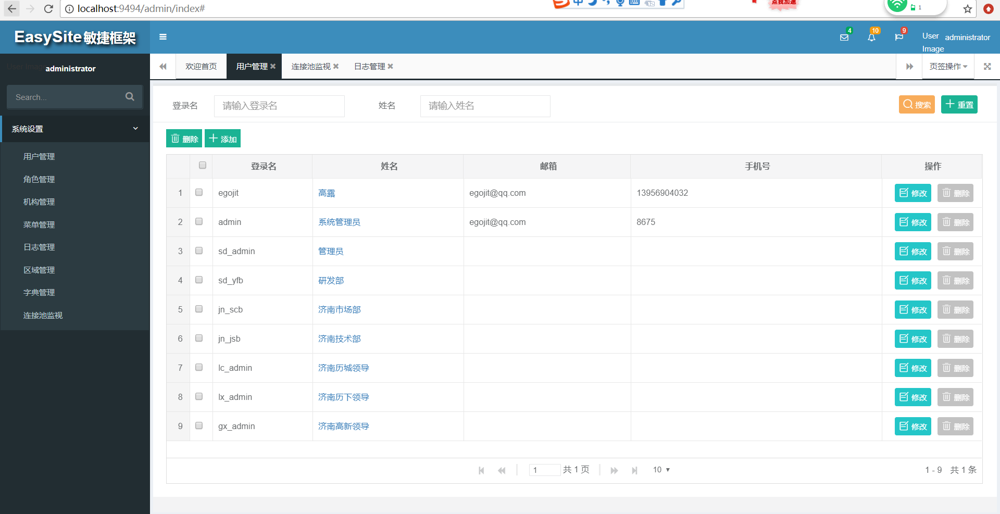
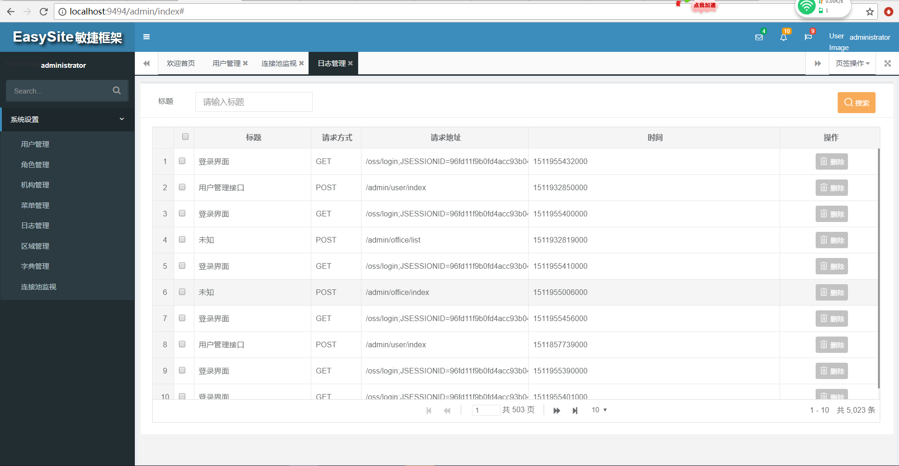

# easyweb
项目代码正在逐步完善中……
# 系统部分截图


# 项目介绍
 基于 Spring boot构建的一套快速开发框架； Spring+SpringMVC+Mybatis+通用mapper+shiro敏捷开发系统架构，后台管理端通过ngix代理远程模板提高性能，做到动静的完全分离；前后端开发完全分离，由于天然支持spring cloud 级微服务，后续根据项目规模可以快速支持分布式;项目陆续支持配置中心、日志分析、任务和通知等，支持服务治理、监控和追踪，努力为型项目打造一套通用快捷的开发框架
``` lua
easyweb
├── egojit-common -- SSM框架公共模块，一些基础类,包括通用utils和通用spring boot config
├── egojit-web -- 后台统一管理模块，单节点部署的统一入口，其中不包含任何实际代码，实际代码被写在各个模块中（端口：9494）
├── egojit-ui --  thymeleaf模板(端口:9999)  通过ngix代理远程模板提高性能，做到动静的完全分离；前后端开发完全分离
├── egojit-upms -- 用户权限管理系统（user power management System）和 登录管理
|    ├── egojit-upms-dao -- 数据访问层，通过通用mapper单表操作基本不用写代码
|    ├── egojit-upms-model -- 数据库模型
|    ├── egojit-upms-service -- 服务和业务逻辑层
|    ├── egojit-upms-micro-service -- 微服务模块
|    ├── egojit-upms-web -- web层管理界面，可以单独跑起来进行分布式部署（端口：9393）
|    ├── egojit-upms-sso -- 基于shiro提供认证、授权、统一会话管理
├── egojit-log -- 日志系统
|    ├── egojit-log-dao -- 数据访问层，通过通用mapper单表操作基本不用写代码
|    ├── egojit-log-model -- 数据库模型
|    ├── egojit-log-service -- 服务和业务逻辑层
|    ├── egojit-log-micro-service -- 微服务模块
|    ├── egojit-log-web -- web层管理界面，可以单独跑起来进行分布式部署（端口：9595）
```
### 开发部署
推荐使用[Intellij IDEA](http://www.jetbrains.com/idea/)作为项目开发ide;
#### 1.创建数据库
执行doc目录下面的最新 mysql脚本新建数据库
#### 2.修改数据库配置
修改每个模块下面web和micro-service子模块的application.yml配置文件中关于数据库连接的配置
#### 3.用idea导入项目
用idea导入项目pom文件以project方式打开；直接跑起管理端主模块egojit-web中的EgojitWebApplication;当然别忘记修改这个模块中的application.yml中的数据库
相关配置；运行完成后就可以打开http://localhost:9494/admin/index
### 技术选型

#### 后端技术:
技术 | 名称 | 官网
----|------|----
Spring boot | 创建独立的Spring应用程序 |[http://projects.spring.io/spring-boot/](http://projects.spring.io/spring-boot/)
Spirng cloud | 分布式整套解决方案 | [http://projects.spring.io/spring-cloud/](http://projects.spring.io/spring-cloud/)
Spring Framework | 容器  | [http://projects.spring.io/spring-framework/](http://projects.spring.io/spring-framework/)
SpringMVC | MVC框架  | [http://docs.spring.io/spring/docs/current/spring-framework-reference/htmlsingle/#mvc](http://docs.spring.io/spring/docs/current/spring-framework-reference/htmlsingle/#mvc)
Apache Shiro | 安全框架  | [http://shiro.apache.org/](http://shiro.apache.org/)
MyBatis | ORM框架  | [http://www.mybatis.org/mybatis-3/zh/index.html](http://www.mybatis.org/mybatis-3/zh/index.html)
MyBatis Generator | 代码生成  | [http://www.mybatis.org/generator/index.html](http://www.mybatis.org/generator/index.html)
PageHelper | MyBatis物理分页插件  | [http://git.oschina.net/free/Mybatis_PageHelper](http://git.oschina.net/free/Mybatis_PageHelper)
通用Mapper | 通用Mapper插件 | [https://mapperhelper.github.io/docs/](https://mapperhelper.github.io/docs/)
Druid | 数据库连接池  | [https://github.com/alibaba/druid](https://github.com/alibaba/druid)
Thymeleaf | 模板引擎  | [http://www.thymeleaf.org/](http://www.thymeleaf.org/)
Velocity | 模板引擎  | [http://velocity.apache.org/](http://velocity.apache.org/)Redis | 分布式缓存数据库  | [https://redis.io/](https://redis.io/)
Quartz | 作业调度框架  | [http://www.quartz-scheduler.org/](http://www.quartz-scheduler.org/)
Ehcache | 进程内缓存框架  | [http://www.ehcache.org/](http://www.ehcache.org/)
ActiveMQ | 消息队列  | [http://activemq.apache.org/](http://activemq.apache.org/)
FastDFS | 分布式文件系统  | [https://github.com/happyfish100/fastdfs](https://github.com/happyfish100/fastdfs)
Log4J | 日志组件  | [http://logging.apache.org/log4j/1.2/](http://logging.apache.org/log4j/1.2/)
Swagger2 | 接口测试框架  | [http://swagger.io/](http://swagger.io/)
Maven | 项目构建管理  | [http://maven.apache.org/](http://maven.apache.org/)

# Hello World
## 关注【千里授渔】微信公众号
#### 公众号分享各种IT教学视频，资源丰富
<div style="align: center"></div>
## 有钱的打赏个硬币
#### 有钱的打赏个硬币多少都接着
                     
